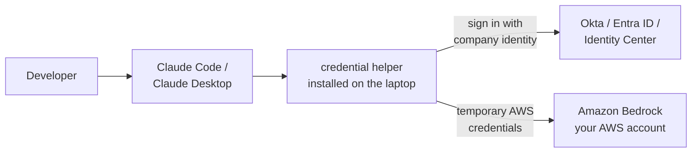
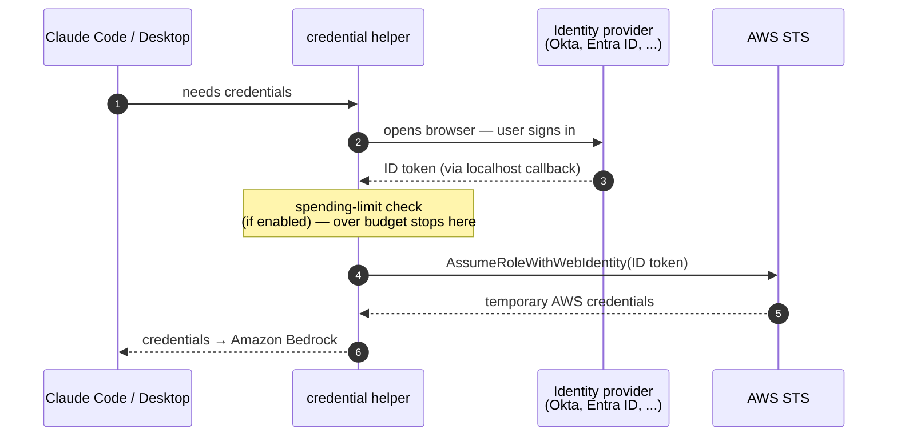
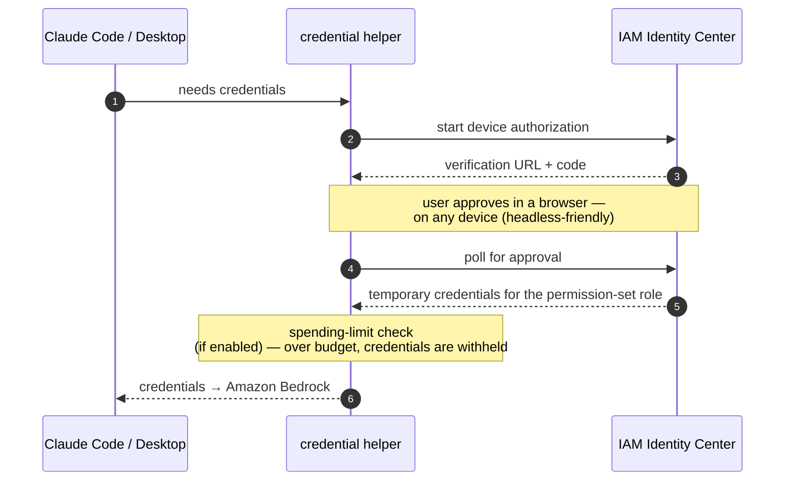

# Claude Code and Claude Desktop for your organization, on Amazon Bedrock

This project lets a company give its developers **Claude Code** (the CLI) and **Claude Desktop** — running entirely against **Amazon Bedrock in the company's own AWS account** — with:

- **Sign-in with company credentials** (Okta, Microsoft Entra ID, Auth0, Google, Amazon Cognito, or AWS IAM Identity Center) — no API keys to hand out or rotate
- **Per-user cost tracking** — dashboards showing who spent what
- **Spending limits** — monthly/daily budgets per user, with warnings and hard blocks
- **Simple installation for end users** — IT ships one zip; users run one installer

Your data stays in your AWS account. No Anthropic license or account is required.

## How it works

An admin deploys the infrastructure once. End users install a small package and sign in.



1. The developer uses Claude Code or Claude Desktop as normal.
2. A small **credential helper** (installed with the package) signs the developer in with their company identity and fetches **temporary** AWS credentials — nothing long-lived is stored on the laptop.
3. If spending limits are enabled, the helper checks the developer's budget **before** issuing credentials. Over budget means no credentials — enforced before any Bedrock call.
4. Usage telemetry flows to CloudWatch dashboards with the user's identity attached, so costs are attributable per person and per team.

## Choose your sign-in method

Pick one during setup — this is the only decision that changes the architecture:

| Your situation | Choose | What users experience |
|---|---|---|
| You have a corporate identity provider (Okta, Entra ID, Auth0, Google, Cognito) | **OIDC** | Browser opens, they sign in with company credentials |
| You use **AWS IAM Identity Center** (with or without an external IdP behind it) | **IAM Identity Center** | Standard AWS SSO device sign-in |
| Neither — users already have AWS access | **None** | No sign-in; monitoring only, no spending limits |

All three support usage dashboards. Spending limits work with OIDC and Identity Center.

### Sign-in flow: OIDC



Repeat sign-ins are silent (refresh token); the browser only opens when the session truly expires.

### Sign-in flow: IAM Identity Center



Because approval can happen on a different device, this flow works on servers and EC2 instances with no browser.

## For admins: deploying it

**You need:** an AWS account with Bedrock model access enabled, Python 3.10+, Poetry, and the AWS CLI. (Go is optional — pre-built binaries are available.)

The `ccwb` tool walks you through everything:

```bash
cd source
poetry run ccwb init          # interactive wizard: sign-in method, region, models, limits
poetry run ccwb deploy        # creates the AWS infrastructure (add --parallel to speed it up)
poetry run ccwb package       # builds the installer package for your users
poetry run ccwb distribute    # uploads it and returns a download link to share
poetry run ccwb test          # verifies the deployment end to end
```

Plan for **2–3 hours** on the first setup (mostly identity-provider configuration). The full walkthrough is in **[QUICK_START.md](QUICK_START.md)**; every command is documented in the [CLI Reference](assets/docs/CLI_REFERENCE.md). If something misbehaves, `poetry run ccwb doctor` diagnoses installations and [Troubleshooting](assets/docs/TROUBLESHOOTING.md) covers common issues.

Works in any AWS region with Bedrock support, including GovCloud. During setup you pick the model (Opus, Sonnet, Haiku) and a cross-region inference profile (US, EU, or global) to control where inference runs for data-residency needs.

## For end users: installing it

Users receive a download link from their admin. Then:

- **Windows:** unzip, run `install.bat`
- **macOS / Linux:** unzip, run `./install.sh`

That's it — the installer configures everything, including the AWS profile Claude Code uses. First use opens a company sign-in; after that, credentials refresh automatically. Users need Claude Code or Claude Desktop installed, and nothing else — no Python, no AWS account of their own, no build tools.

**Claude Desktop** is configured centrally instead of per-user: `poetry run ccwb cowork generate` produces ready-to-deploy MDM files (JSON, macOS `.mobileconfig`, Windows `.reg`) for Jamf, Intune, or Group Policy. See the [Claude Desktop (Cowork 3P) Guide](assets/docs/COWORK_3P.md). One deployment serves both surfaces, and a user's spending limit is shared across both.

## Optional add-ons

Everything below is opt-in during `ccwb init` and can be added later:

| Add-on | What it gives you | Guide |
|---|---|---|
| **Monitoring** | CloudWatch dashboards: usage and cost per user, team, and model | [Monitoring](assets/docs/MONITORING.md) |
| **Spending limits** | Per-user/per-team monthly and daily budgets (USD or tokens); warn at thresholds, block at the limit | [Quota Monitoring](assets/docs/QUOTA_MONITORING.md) |
| **Analytics** | Long-term usage history queryable with SQL (S3 + Athena) | [Analytics](assets/docs/ANALYTICS.md) |
| **Distribution** | Presigned download links, or a self-service download page behind your IdP | [Distribution options](assets/docs/distribution/comparison.md) |
| **Bootstrap server** | Delivers per-user settings and [organization plugins](assets/docs/PLUGINS.md) to Claude Desktop at sign-in — no MDM re-push for config changes | [Plugins](assets/docs/PLUGINS.md) |

Infrastructure running costs are modest and scale with team size — see [Cost Estimates](assets/docs/COST_ESTIMATES.md). Per-user Bedrock costs appear in Cost Explorer automatically via [CUR 2.0 cost attribution](assets/docs/COST_ATTRIBUTION.md).

## About this repository

This is a maintained fork of the AWS Solutions guidance [guidance-for-claude-code-with-amazon-bedrock](https://github.com/aws-solutions-library-samples/guidance-for-claude-code-with-amazon-bedrock), carrying fixes (each with regression tests) for the IAM Identity Center, Windows, and non-`us-east-1` deployment paths. The upstream repository is in maintenance mode.

<details>
<summary><strong>Considering alternatives?</strong> Anthropic's Claude Apps Gateway</summary>

For new deployments, AWS and Anthropic recommend evaluating [Claude Apps Gateway](https://code.claude.com/docs/en/claude-apps-gateway) — a self-hosted service built into the `claude` binary that provides corporate SSO, per-user spend caps, managed settings, and telemetry routing from a single stateless container. See [Claude Apps Gateway on AWS](https://github.com/aws-samples/anthropic-on-aws/tree/main/claude-apps-gateway).

This project still covers ground the gateway does not yet: native AWS IAM Identity Center sign-in (no external OIDC needed), historical usage analytics with Athena, automated multi-platform installer packaging, and IAM-principal-based cost allocation.

</details>

## Documentation

**Getting started:** [Quick Start](QUICK_START.md) · [CLI Reference](assets/docs/CLI_REFERENCE.md) · [Troubleshooting](assets/docs/TROUBLESHOOTING.md) · [Hands-on workshop](https://catalog.workshops.aws/claude-code-on-amazon-bedrock/en-US)

**Identity provider setup:** [Okta](assets/docs/providers/okta-setup.md) · [Microsoft Entra ID](assets/docs/providers/microsoft-entra-id-setup.md) · [Auth0](assets/docs/providers/auth0-setup.md) · [Google](assets/docs/providers/google-oidc-setup.md) · [Cognito](assets/docs/providers/cognito-user-pool-setup.md) · [Generic OIDC](assets/docs/providers/generic-oidc-setup.md)

**Going deeper:** [Architecture](assets/docs/ARCHITECTURE.md) · [Advanced deployment](assets/docs/DEPLOYMENT.md) · [Local testing](assets/docs/LOCAL_TESTING.md) · [Claude Desktop (Cowork 3P)](assets/docs/COWORK_3P.md) · [Deployment patterns blog post](https://aws.amazon.com/blogs/machine-learning/claude-code-deployment-patterns-and-best-practices-with-amazon-bedrock/)

## License

MIT — see [LICENSE](LICENSE).
